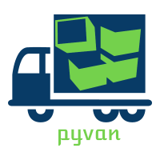

<p align="center">
  
</p>

<p align="center">
  <h2> Make runnable desktop/cmd apps from your python scripts!</h2>
</p>


[](https://pepy.tech/project/pyvan) [](https://pypi.org/project/pyvan/)


### Install
```py
pip install pyvan
```
or download [pyvan.py](https://raw.githubusercontent.com/ClimenteA/pyvan/master/src/pyvan.py) file.

### Usage

Using the command line:

`pyvan main.py` or `pyvan main.py --no-console` for a gui application.

You can see available flags with: `pyvan --help`

*or*

Make a "van.py" file next to the "main.py" file (entry point of your program) 

Paste the code bellow:

```py
import pyvan

OPTIONS = {
  "main_file_name": "main.py",
  "show_console": False,
  "use_existing_requirements": True,
  "extra_pip_install_args": [],
  "python_version": None,
  "use_pipreqs": False,
  "install_only_these_modules": [],
  "exclude_modules": [],
  "include_modules": [],
  "path_to_get_pip_and_python_embedded_zip": "",
  "build_dir": "dist",
  "pydist_sub_dir": "pydist",
  "source_sub_dir": "",
  "icon_file": None,
}

pyvan.build(**OPTIONS)

 
```


### Configurations

**Option**|**Default**|**Description**
-----|-----|-----
main\_file\_name|*required*|the entry point of the application
show\_console|True|show console window or not (for a service or GUI app)
use\_existing\_requirements|True|if True pyvan will use an existing requirements.txt file instead of generating one using the: `use\_pipreqs
extra\_pip\_install\_args|[]|pyvan will append the provided arguments to the pip install command during installation of the stand-alone distribution.The arguments should be specified as a list of strings
python\_version|None|pyvan will attempt use the specified Python distribution for creating the stand-alone application, `3.8.x`, `3.9.1`, or `x.x.x` are valid formats
use\_pipreqs|True|pipreqs tries to minimize the size of your app by looking at your imports (best way is to use a virtualenv to ensure a smaller size
install\_only\_these\_modules|[]|pyvan will install only the modules mentioned here
exclude\_modules|[]|modules to exclude from bundle
include\_modules|[]|modules to include in the bundle
path\_to\_get\_pip\_and\_python\_embedded\_zip|''|by default is the Download path (path to 'get-pip.py' and 'python-x.x.x-embed-amdxx.zip' files)
build\_dir|dist|the directory in which pyvan will create the stand-alone distribution
pydist\_sub\_dir|pydist|a sub directory relative to `build_dir` where the stand-alone python distribution will be installed
source\_sub\_dir|''|a sub directory relative to `build_dir` where the to execute python files will be installed
input\_dir|'.'|the directory to get the main\_file\_name file from
icon\_file|None|path to icon file to use for your application executable, doesn't use one by default 


**Thanks to [silvandeleemput](https://github.com/silvandeleemput) for extending the available options, adding support for CLI commands, automating the download of get-pip.py, 
embedded python zip and making possible the generation of an executable file!**

I think pyvan is the only python bundler which makes possible shipping a python application along with a modifiable source code.


If pyvan didn't manage to install all the modules needed go in dist/Scripts folder and install them manually with `pip install module`

Since Mac and Linux have already Python installed pyvan focuses only on Windows.


### Why pyvan?

**pyvan** it's just one file which takes the embedded python version, installs the modules you need and makes a link using a .exe file between python.exe and your main.py script.
<br>
It's easy if something goes wrong for whatever reason you can just go in the dist folder and solve the issue the python way (because there is just python and your scripts :).


**Submit any questions/issues you have! Fell free to fork it and improve it!**
